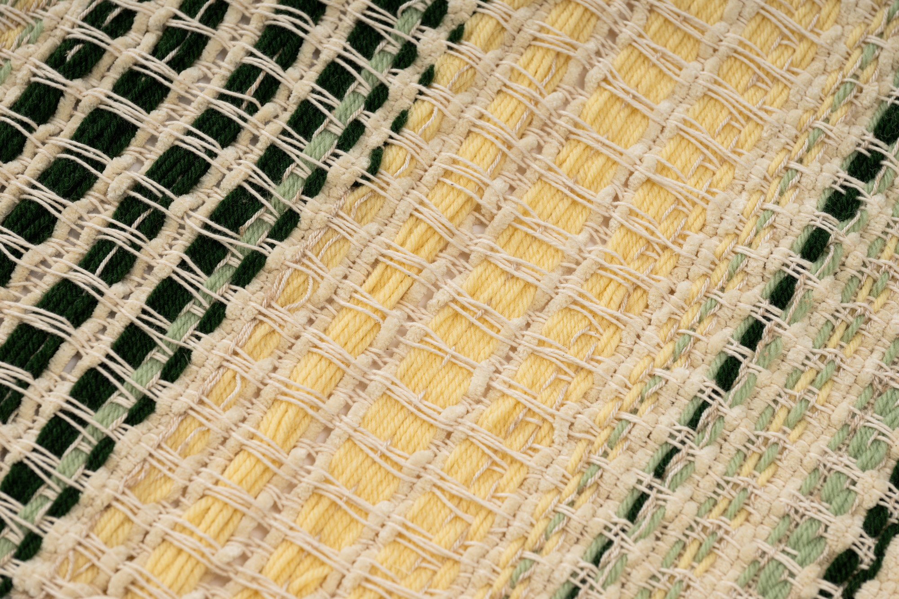
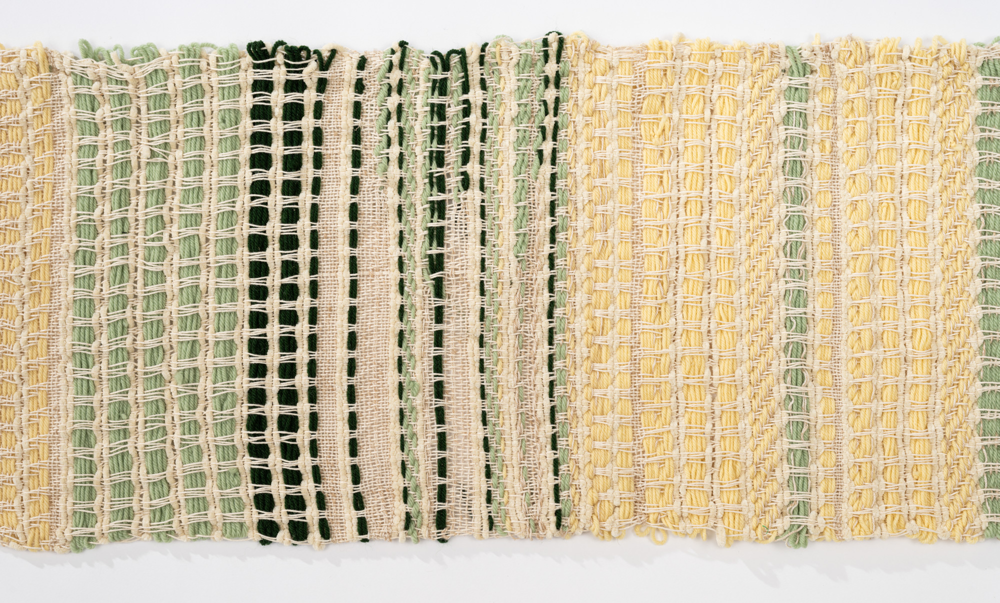
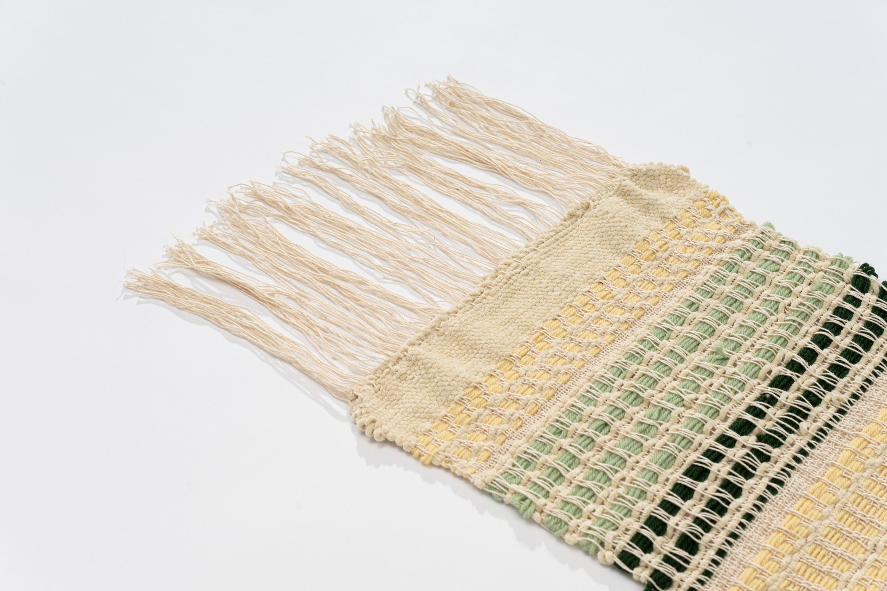
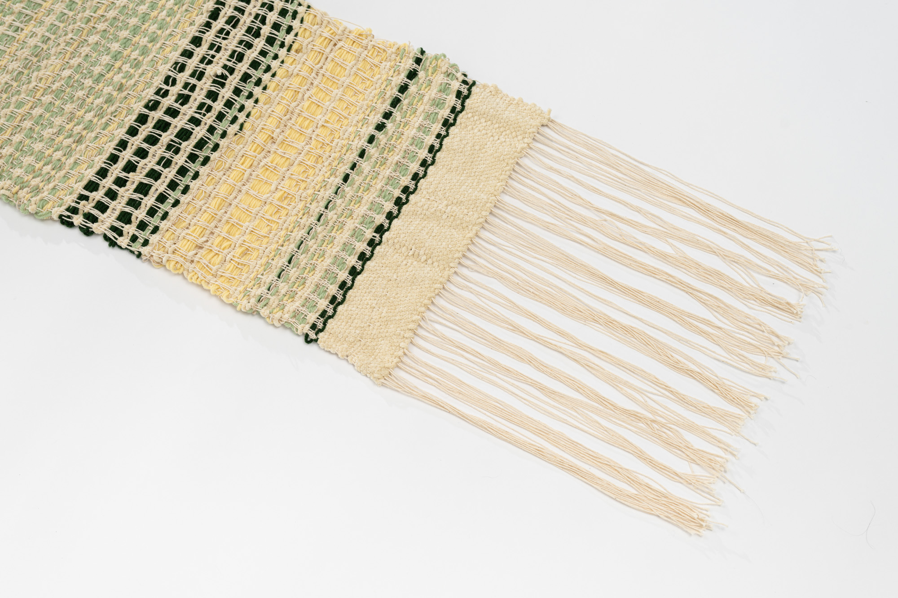
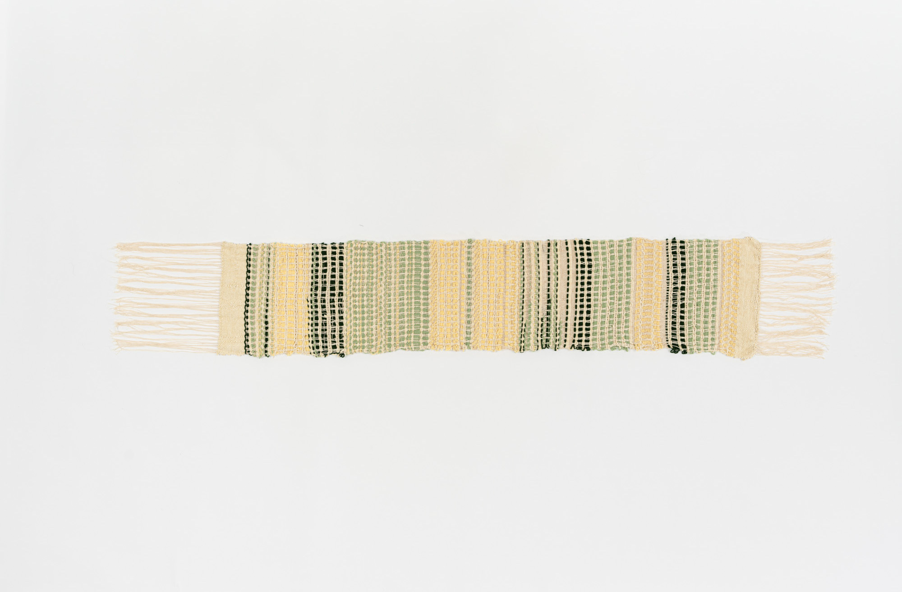

<button type="button" data-bs-target="#mozard" data-bs-slide-to="0" class="active" aria-current="true" style="background-color: var(--textile-accent);"></button>
<button type="button" data-bs-target="#mozart" data-bs-slide-to="1" style="background-color: var(--textile-accent);"></button>
<button type="button" data-bs-target="#mozart" data-bs-slide-to="2" style="background-color: var(--textile-accent);"></button>
<button type="button" data-bs-target="#mozart" data-bs-slide-to="3" style="background-color: var(--textile-accent);"></button>
<button type="button" data-bs-target="#mozart" data-bs-slide-to="4" style="background-color: var(--textile-accent);"></button>

  

  

  

  

  

<button class="carousel-control-prev" type="button"data-bs-target="#mozart" data-bs-slide="prev" 
      onclick="event.stopPropagation();">

Previous
</button>

<button class="carousel-control-next" type="button"data-bs-target="#mozart" data-bs-slide="next" 
      onclick="event.stopPropagation();">

Next
</button>

    

    Mozart --- Symphony No. 1

    Cotton and Wool Yarn

[ + ] Details

This weave is a partial translation of the first violin line from Mozart’s
_Symphony No. 1_. The pitch of a note is indicated using the color and placement of the thread. The loom was programmed with a nine-pedal pattern. This tapestry uses a cotton warp and a wool weft. When each pedal is pressed down it lifts the designated warp threads. When a weft thread is placed underneath the lifted thread, it leaves some portions of the weft exposed. This creates a pattern of exposed warp (vertical threads) and weft (horizontal threads) that is slightly different depending on which pedal has been pressed. Every note in the key signature was assigned to each pedal. This results in each note leaving a slightly different pattern on the final weave. Rests and silences in the music are indicated using a thin white thread in a plain weave. Plain weave is the most basic weave pattern in which every other warp thread is lifted. The final weave uses three colors: dark green, mid-tone green, and yellow. These colors indicate which octave a note falls into, with the dark green thread being the lowest octave and the yellow thread being the highest. For example, if one were to weave a “D” on the staff followed by a “D” below the staff, the same pedal would be pressed both times, but the first would be strung with a mid-tone green and the second with a darker green. 

The duration of each note is indicated by how many times the weft string passes over the warp. In the final weaving, each pass over the warp was equivalent to half a beat. For example, two passes over the warp would indicate a quarter note. After each note was placed into the weaving, a thin white thread would be threaded in between each note to act as a spacing between each note. For notes shorter than half a beat, a colored thread would be strung across a portion of the warp, with the rest of that line being filled in by a note spacing thread. For example, a sixteenth note would be strung across exactly half of the warp before being filled in with a spacer. This spacing thread allows the viewer to determine the beginning and end of each note and differentiate notes from one another. The end of each measure is indicated by two passes of a thick white yarn. This acts as an indicator of time signature. One could count the number of threads between each measure indicator to determine how many beats fit into each measure. Once all these elements have been combined and applied to a piece of music, an abstract woven pattern begins to form.

 

<button type="button" data-bs-target="#swan" data-bs-slide-to="0" class="active" aria-current="true" style="background-color: var(--textile-accent);"></button>
<button type="button" data-bs-target="#swan" data-bs-slide-to="1" style="background-color: var(--textile-accent);"></button>

<button class="carousel-control-prev" 
      type="button"data-bs-target="#swan" data-bs-slide="prev" 
      onclick="event.stopPropagation();">

Previous
</button>
<button class="carousel-control-next" type="button"data-bs-target="#swan" data-bs-slide="next" 
      onclick="event.stopPropagation();">

Next
</button>

  Saint-Saëns --- The Swan

  Cotton and Bamboo Yarn

[ + ] Details

